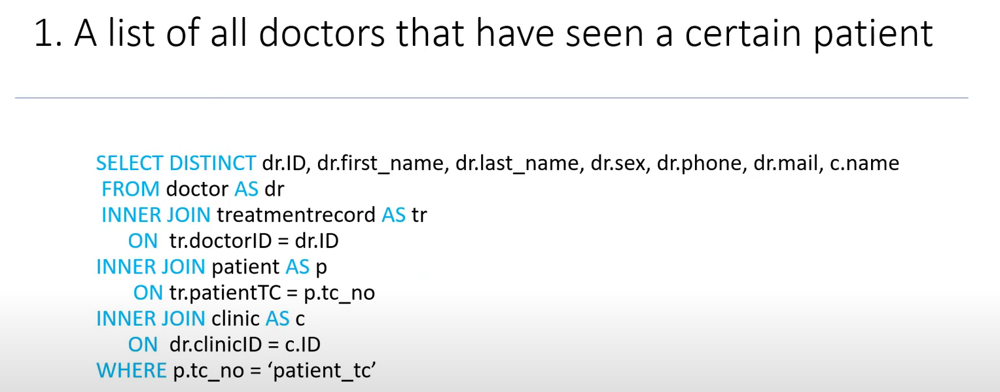
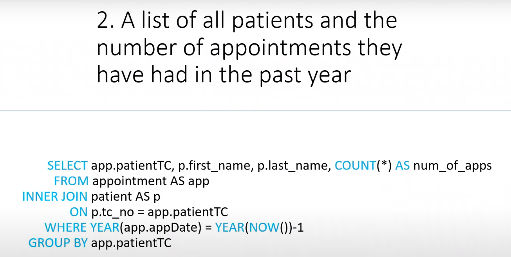
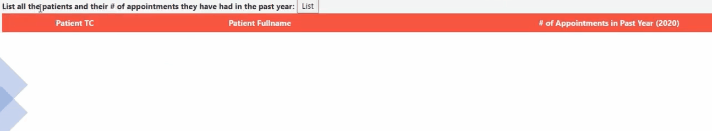
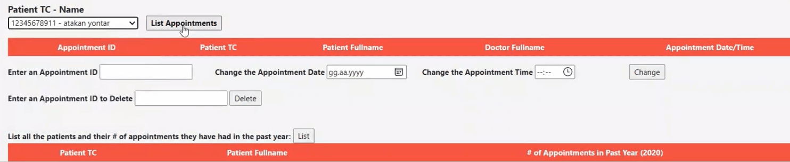
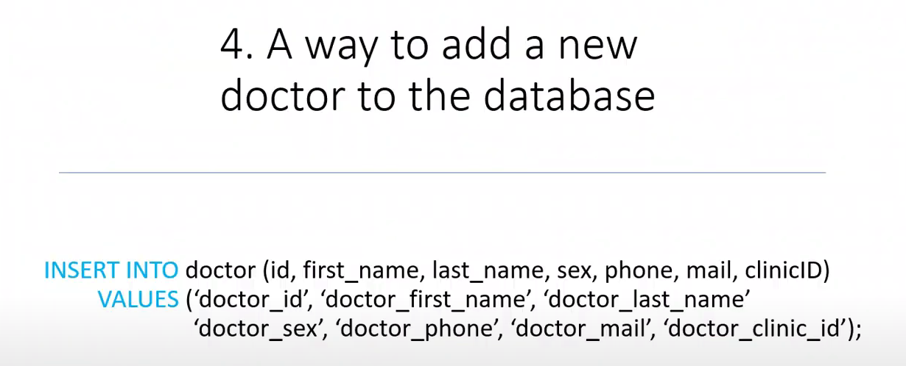
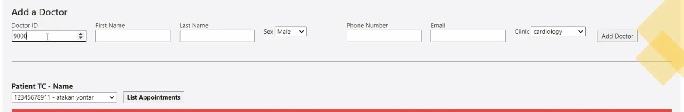
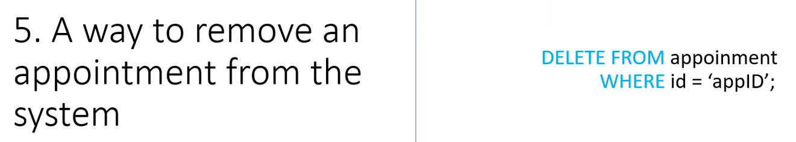
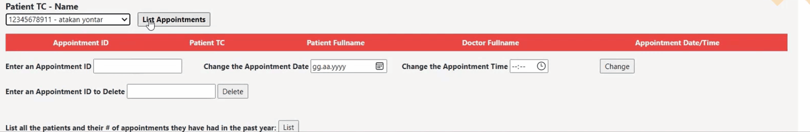

# Hospital Management System

This project is a **Hospital Management System** database that provides a structured way to store and manage hospital-related data, such as patients, doctors, staff, and appointments. The project consists of SQL queries for creating and populating the database, along with images representing the system's architecture and design.

## Project Structure

The project contains the following main folders:

- **img**: Contains images related to the database structure, including ER diagrams and schema designs.
- **sql-query**: Contains SQL files for database setup, data insertion, and queries.

## Features

- **Patient Management**: Record and manage patient details, including personal information, medical history, and treatment records.
- **Doctor Management**: Track doctor information, specializations, and schedules.
- **Staff Management**: Manage staff details such as roles, shifts, and contact information.
- **Appointment Scheduling**: Handle patient appointment scheduling with doctors.
- **Billing and Payments**: Track billing records and manage patient payments.

## Getting Started

### Prerequisites

- **Database Management System (DBMS)**: Install any SQL-compatible DBMS such as MySQL, PostgreSQL, or SQLite.

## The E-R Diagram of our Database

 

 

## SQL Queries for Creating a Database in Third Normalized form
1. [Creating the UNF table](sql-queries/creating-the-unf-table.md)
2. [Forming 3NF tables from the UNF table](sql-queries/creating-3nf-tables-from-the-unf.md)
3. [Creating view of Patient Records by joining every table](sql-queries/view-of-patient-records.md)

  

## Custom Queries to make Hospital Management System more functional 

 

- Listing all doctors that have seen a certain patient 

  

 

The actual usage of the query above

 

- Listing all of the patients with the number of appointments they have had in the last year

  

 

The actual usage of the query above

 

- Changing the date of an appointment

  

 

- Listing all doctors that have seen a certain patient 

  

The actual usage of the query above

 

- Adding a new doctor to the system

  

 

The actual usage of the query above

 

- Removing an appointment from the system

  

 

The actual usage of the query above

 
